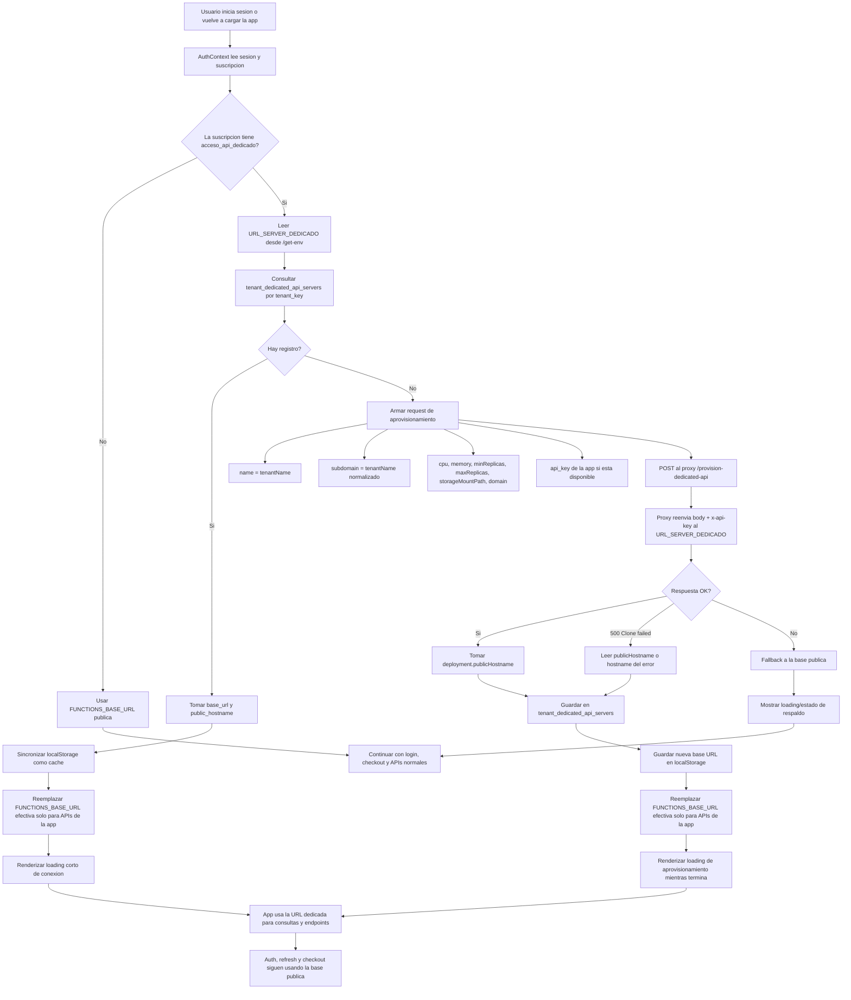

# Flujo de APIs dedicadas

## Decisiones clave

- `FUNCTIONS_BASE_URL` sigue siendo la base publica/central.
- `URL_SERVER_DEDICADO` es la URL del servicio que aprovisiona el tenant dedicado.
- El navegador llama a `/provision-dedicated-api` y el backend hace el POST real al servicio externo, reenviando `x-api-key` o `api_key` cuando existen.
- La relation `tenant -> servidor dedicado` se persiste en `tenant_dedicated_api_servers` y `localStorage` queda solo como cache local.
- `publicHostname` es la URL efectiva que usa la app una vez creado el servidor.
- Si el clon ya existe, se reutiliza el hostname existente en vez de romper el flujo.
- Durante el aprovisionamiento se muestra un estado de carga especifico para que el usuario entienda que esta pasando.
